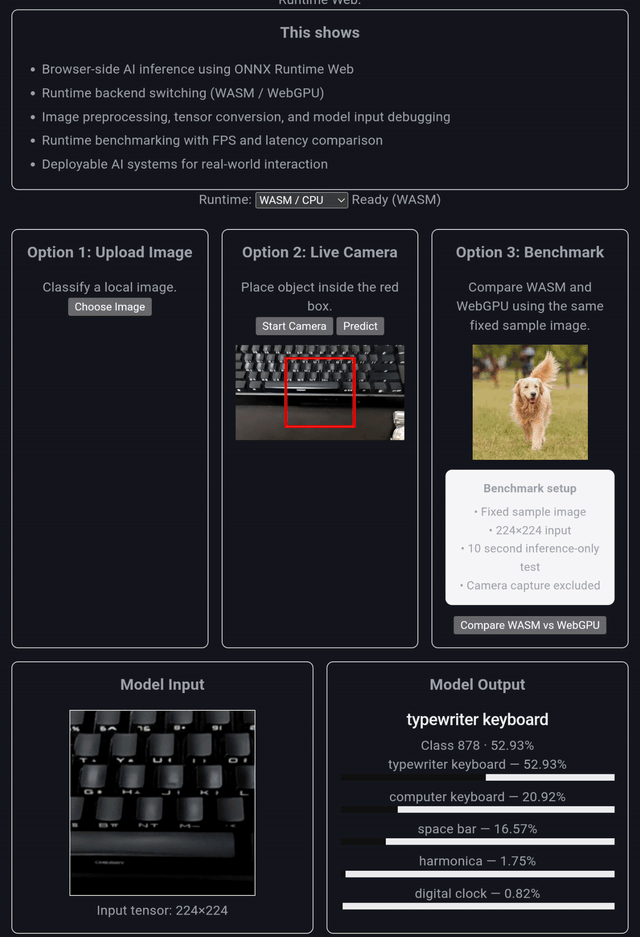

# Browser-Native AI Runtime

Browser-side AI inference using **ONNX Runtime Web** with interchangeable **WASM / WebGPU backends**, interactive camera inference, and runtime benchmarking.

Designed to explore **deployable AI inference across desktop, mobile, and edge-capable browser environments**.

**Pipeline**

```text
Image → preprocess → tensor → ONNX Runtime → inference → postprocess
```

## Demo

🌐 Demo: https://junseongahn.github.io/browser-ai-runtime/



## What It Does

### Upload Image

- Browser-side inference
- Top-5 prediction
- Model input preview

### Live Camera

- Red-box guided center crop
- Real-time inference
- Resized model input debugging

### Runtime Benchmark

Compare **WASM (CPU)** vs **WebGPU (GPU)** using the same fixed sample image.

- 224×224 input
- 10-second inference-only benchmark
- FPS + latency comparison
- Camera overhead excluded

## Cross-Device Benchmark

Inference-only benchmark using the same fixed sample image.

### Desktop

Intel Pentium Gold G5400 + NVIDIA GTX 750 Ti

| Backend | FPS | Avg Latency |
| ------- | --- | ----------- |
| WASM    | ~16 | ~63 ms      |
| WebGPU  | ~99 | ~10 ms      |

**Result:** WebGPU achieved approximately **6× higher throughput** than WASM.

### Tablet

Lenovo Tab M11

| Backend | FPS | Avg Latency |
| ------- | --- | ----------- |
| WASM    | ~7  | ~133 ms     |
| WebGPU  | ~12 | ~80 ms      |

**Result:** WebGPU achieved approximately **1.67× higher throughput** than WASM.

_Performance depends on browser, hardware, thermal limits, and WebGPU support._

## Tech Stack

**React · TypeScript · Vite · ONNX Runtime Web · MobileNetV2 · WebGPU / WASM**

## This Shows

- Browser-side AI deployment
- Runtime backend switching (**WASM / WebGPU**)
- Image preprocessing & tensor debugging
- Runtime benchmarking (**FPS + latency**)
- Deployable real-time AI systems across desktop and mobile devices
